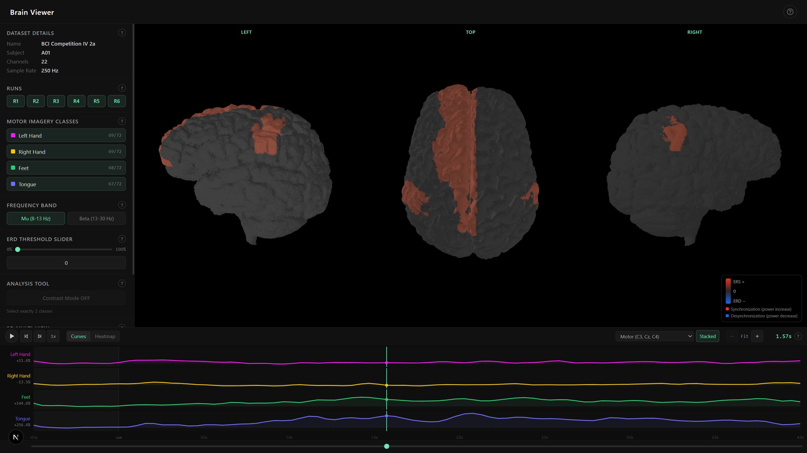

# Web-based Visual Analytics Framework for EEG Motor Imagery Signals

A lightweight, browser-based visual analytics platform for exploring Electroencephalography (EEG) Motor Imagery (MI) data. The system processes neuroimaging volumes into an interactive 3D brain model with anatomical region segmentation and EEG electrode mapping, all rendered in real-time using WebGL.

Developed as part of a Bachelor Thesis at TU Wien.

---

## Table of Contents

- [Overview](#overview)
- [Screenshot](#screenshot)
- [Features](#features)
- [Architecture](#architecture)
- [Technology Stack](#technology-stack)
- [Project Structure](#project-structure)
- [Prerequisites](#prerequisites)
- [Installation](#installation)
- [Configuration](#configuration)
- [Usage](#usage)
- [Dataset](#dataset)
- [License](#license)

---

## Overview

Interpreting raw EEG signals for Motor Imagery Brain-Computer Interfaces (BCI) remains a significant challenge due to the high dimensionality and abstract nature of the data. Traditional analysis tools are often desktop-bound, resource-intensive, and lack intuitive spatial visualisation.

This project provides a web-based alternative: a pipeline that converts structural MRI data (NIfTI volumes) into a region-segmented 3D brain mesh, maps EEG electrodes from the international 10-20 system onto the cortical surface, and renders the result as an interactive 3D viewer in any modern web browser. The system is designed around the [BCI Competition IV-2a dataset](http://www.bbci.de/competition/iv/) (22-channel EEG, 9 subjects, 4 motor imagery classes) and the Destrieux 2009 cortical atlas.

---

## Screenshot



---

## Features

- **3D Brain Mesh Generation** -- Isosurface extraction from T1-weighted MRI volumes using Marching Cubes, with optional mesh decimation for performance tuning.
- **Destrieux Atlas Segmentation** -- Automated region labelling of every mesh vertex against the Destrieux 2009 cortical atlas, with volumetric gap-filling and mesh-adjacency propagation for unlabelled vertices.
- **EEG Electrode Mapping** -- Projection of 22 standard 10-20 electrode positions onto the cortical surface via MNI-to-voxel coordinate transformation and inward ray-casting.
- **Interactive 3D Viewer** -- WebGL-based brain model with orbit controls, region identification on hover, and region highlighting with a glow overlay effect.
- **SSAO Post-Processing** -- Screen-Space Ambient Occlusion to enhance the visual depth of cortical sulci and gyri.
- **Electrode Sidebar** -- Grouped display of all EEG channels by their mapped cortical region, with bidirectional hover highlighting between the sidebar and the 3D model.
- **Configurable Pipeline** -- All paths, processing parameters, and feature flags managed through a single `.env` file.

---

## Architecture

The project follows a two-stage architecture:

1. **Backend (Python)** -- An offline processing pipeline that reads NIfTI neuroimaging volumes, generates a region-coloured brain mesh (PLY), maps EEG electrodes to cortical regions, and exports all data as static assets (PLY mesh + JSON metadata) for the frontend.

2. **Frontend (Next.js / Three.js)** -- A client-side web application that loads the pre-processed PLY mesh and JSON metadata, then renders an interactive 3D brain viewer with region hover detection, glow-based highlighting, and an electrode information sidebar.

The backend does not serve data at runtime. All processing is done ahead of time, and the frontend consumes the resulting static files.

```
NIfTI Volumes ──> [Backend Pipeline] ──> PLY Mesh + JSON ──> [Frontend Viewer]
  (T1w, Mask)      (Python / MNE)        (Static Assets)     (Next.js / Three.js)
```

---

## Technology Stack

### Backend

| Component | Purpose |
|---|---|
| Python 3.10+ | Pipeline runtime |
| MNE-Python | EEG montage and electrode coordinate retrieval |
| nibabel | NIfTI file I/O |
| nilearn | Destrieux atlas fetching and resampling |
| scikit-image | Marching Cubes isosurface extraction |
| Open3D | Mesh processing, decimation, PLY export, optional viewer |
| PyTorch | GPU-accelerated volume operations (CUDA / MPS / CPU) |
| NumPy / SciPy | Array operations, distance transforms |

### Frontend

| Component | Version | Purpose |
|---|---|---|
| Next.js | 16.1.6 | React framework (App Router) |
| React | 19.2.3 | UI component model |
| Three.js | 0.183.1 | WebGL 3D rendering, SSAO post-processing |
| Vanilla CSS | -- | Styling (no UI framework dependencies) |

---

## Project Structure

```
bsc-tuwien-eeg-web/
|-- backend/
|   |-- main.py                         Pipeline entry point
|   |-- config.py                       Centralised configuration (dataclass + .env)
|   |-- .env.example                    Example environment variables
|   |-- model/
|   |   |-- loader.py                   NIfTI loading, masking, normalisation
|   |   `-- pointcloud.py               Marching Cubes mesh generation + region mapping
|   |-- regions/
|   |   |-- atlas.py                    Destrieux atlas fetching, resampling, gap-fill
|   |   |-- palette.py                  Region colour palette generation
|   |   `-- mapping.py                  Legacy PLY vertex-to-region mapping
|   |-- electrode/
|   |   `-- mapping.py                  Electrode-to-region mapping + JSON export
|   |-- eeg/
|   |   |-- loader.py                   GDF loading and fallback demo data
|   |   |-- processing.py               EEG epoching, filtering, and features
|   |   `-- export.py                   Browser-ready EEG JSON export
|   |-- viewer/
|   |   `-- viewer.py                   Interactive Open3D desktop viewer
|   `-- testing/
|-- frontend/
|   |-- app/
|   |   |-- layout.js                   Root layout and metadata
|   |   |-- page.js                     Main page with state management
|   |   |-- globals.css                 Full CSS design system
|   |   |-- lib/
|   |   |   `-- eeg.js                  EEG data helpers
|   |   `-- components/
|   |       |-- BrainViewer.jsx         Three.js renderer + SSAO + hover + highlight
|   |       |-- DatasetPanel.jsx        Dataset controls and metadata panel
|   |       |-- ElectrodeSidebar.jsx    Electrode list grouped by region
|   |       |-- InfoPopup.jsx           Region/electrode hover details
|   |       |-- Timeline.jsx            EEG timeline container
|   |       |-- TimelineCurves.jsx      EEG curve visualisation
|   |       `-- TimelineHeatmap.jsx     EEG heatmap visualisation
|   |-- public/data/                    Static assets served to the browser
|   |   |-- brain_mesh_destrieux_mapped.ply
|   |   |-- region_metadata.json
|   |   `-- eeg_data.json
|   `-- package.json
|-- data/
|   |-- eeg/
|   |   |-- README.md
|   |   |-- A01T.gdf                   Included BCI Competition IV-2a training file
|   |   `-- A01E.gdf                   Included BCI Competition IV-2a evaluation file
|   |-- img/
|   |   |-- brainviewer.png            Frontend screenshot used in this README
|   |   |-- Placement_Electrodes.png
|   |   |-- 3D Electrodes Mapping.png
|   |   |-- model-types.png
|   |   `-- inspiration/
|   |-- model/
|   |   `-- mapped/brainmapping_exports/
|   |       `-- brain_mesh_destrieux_mapped.ply
|   `-- nfbs/
|       |-- A00063008_NFB3_T1w.nii
|       |-- A00063008_NFB3_T1w_brain.nii
|       `-- A00063008_NFB3_T1w_brainmask.nii
|-- doc/
|   |-- Browser Layout.pdf
|   |-- Dataset_Desc_2a.md
|   |-- Dataset_Desc_2a.pdf
|   |-- Timeline.md
|   `-- Timeline.pdf
|-- bsc/
|   |-- Code_Documentation.md
|   |-- Frontend_Design_Review.md
|   |-- Progress_Documentation.md
|   `-- thesis-proposal/
|-- requirements.txt
|-- README.md
`-- .gitignore
```

---

## Prerequisites

- **Python** 3.10 or later
- **Node.js** 18 or later (with npm)
- **GPU** (optional) -- CUDA-capable GPU for faster volume processing; falls back to CPU automatically

---

## Installation

### 1. Clone the repository

```bash
git clone <repository-url>
cd bsc-tuwien-eeg-web
```

### 2. Set up the Python environment

```bash
python -m venv venv
```

Activate the virtual environment:

```bash
# Windows
venv\Scripts\activate

# macOS / Linux
source venv/bin/activate
```

Install dependencies:

```bash
pip install -r requirements.txt
```

### 3. Set up the Frontend

```bash
cd frontend
npm install
cd ..
```

### 4. Verify the included input data

The repository includes the sample NIfTI volumes used by the backend pipeline in `data/nfbs/`. These files are from the Neurofeedback Skull-stripped (NFBS) repository, collected as part of the Enhanced Rockland Sample Neurofeedback Study. The pipeline expects three files:

- `A00063008_NFB3_T1w.nii` -- Full T1-weighted MRI volume
- `A00063008_NFB3_T1w_brain.nii` -- Skull-stripped brain volume
- `A00063008_NFB3_T1w_brainmask.nii` -- Binary brain mask

The repository also includes two BCI Competition IV-2a GDF files in `data/eeg/`:

- `A01T.gdf` -- Subject 1 training session
- `A01E.gdf` -- Subject 1 evaluation session

To use different subjects or sessions, add the corresponding GDF files to `data/eeg/` and update `EEG_SUBJECT` and `EEG_SESSION` in `backend/.env`.

---

## Configuration

Copy the example environment file and adjust as needed:

```bash
cp backend/.env.example backend/.env
```

Key configuration options:

| Variable | Description | Default |
|---|---|---|
| `BRAIN_NII_PATH` | Path to skull-stripped brain NIfTI | `./data/nfbs/A00063008_NFB3_T1w_brain.nii` |
| `BRAIN_T1W_NII_PATH` | Path to full T1w volume | `./data/nfbs/A00063008_NFB3_T1w.nii` |
| `BRAIN_MASK_NII_PATH` | Path to brain mask | `./data/nfbs/A00063008_NFB3_T1w_brainmask.nii` |
| `MESH_TARGET_FACES` | Decimation target (0 = no decimation) | `300000` |
| `MC_LEVEL` | Marching Cubes isosurface intensity level | `0.15` |
| `DEVICE` | Compute device (`auto`, `cpu`, `cuda`, `mps`) | `auto` |
| `SHOW_VIEWER` | Launch Open3D viewer after pipeline | `false` |
| `COPY_MAPPED_MESH_TO_FRONTEND` | Auto-copy PLY to frontend public dir | `false` |
| `EEG_CHANNELS` | Comma-separated list of 10-20 channel names | 22-channel standard set |

See `backend/.env.example` for the full list of options with descriptions.

---

## Usage

### Run the backend pipeline

From the project root:

```bash
python -m backend.main
```

This executes the full processing pipeline:

1. Load NIfTI volumes (T1w + brain mask)
2. Fetch and resample the Destrieux 2009 atlas
3. Gap-fill unlabelled brain voxels
4. Generate the brain mesh via Marching Cubes
5. Assign region IDs per vertex (forward-carry from atlas)
6. Map EEG electrodes to cortical regions
7. Export `brain_mesh_destrieux_mapped.ply`, `region_metadata.json`, and `eeg_data.json` to `frontend/public/data/`

### Start the frontend

```bash
cd frontend
npm run dev
```

Open [http://localhost:3000](http://localhost:3000) in a browser to view the interactive 3D brain model.

---

## Dataset

The repository uses two external data sources: NFBS neuroimaging data for the structural brain model and BCI Competition IV-2a EEG data for motor imagery signals.

### NFBS / Enhanced NKI-RS Neurofeedback Data

The included NIfTI files in `data/nfbs/` are sourced from the **Neurofeedback Skull-stripped (NFBS) repository**:

- `A00063008_NFB3_T1w.nii`
- `A00063008_NFB3_T1w_brain.nii`
- `A00063008_NFB3_T1w_brainmask.nii`

NFBS is a database of 125 manually skull-stripped T1-weighted anatomical MRI scans. It provides gold-standard training and testing data for skull-stripping and related machine-learning workflows, and was collected as part of the Enhanced Rockland Sample Neurofeedback Study.

Source pages:

- [NFBS Skull-Stripped Repository](https://preprocessed-connectomes-project.org/NFB_skullstripped/)
- [NFBS GigaScience data note](https://doi.org/10.1186/s13742-016-0150-5)
- [NKI-RS About page](https://rocklandsample.org/about)

### BCI Competition IV-2a EEG Data

The visualisation framework is designed around the **BCI Competition IV-2a dataset**, listed by BNCI Horizon 2020 as **Four class motor imagery (001-2014)**, a standard benchmark for motor imagery EEG research:

- **Subjects**: 9
- **Motor imagery classes**: Left Hand, Right Hand, Feet, Tongue
- **Electrodes**: 22 Ag/AgCl channels (international 10-20 system)
- **Sampling rate**: 250 Hz
- **Bandpass filter**: 0.5--100 Hz (recording), 8--30 Hz (Mu/Beta isolation for MI analysis)
- **Included files**: `data/eeg/A01T.gdf`, `data/eeg/A01E.gdf`
- **License**: [Creative Commons Attribution No Derivatives 4.0 International (CC BY-ND 4.0)](https://creativecommons.org/licenses/by-nd/4.0/)
- **Licensor**: Institute for Knowledge Discovery, Graz University of Technology

For full details on the dataset structure, event types, and evaluation criteria, see `doc/Dataset_Desc_2a.md`.

**Reference**: C. Brunner, R. Leeb, G. R. Mueller-Putz, A. Schloegl, and G. Pfurtscheller, "BCI Competition 2008 -- Graz data set A," Institute for Knowledge Discovery, Graz University of Technology, Austria, 2008.

Source page: [BNCI Horizon 2020 data sets - Four class motor imagery (001-2014)](https://bnci-horizon-2020.eu/database/data-sets)

---

## License

This project is developed as part of a Bachelor Thesis at TU Wien. Please contact the author for licensing information about the project code and original project materials.

Third-party data remains governed by its original source terms:

- NFBS neuroimaging data: cite the NFBS data note by Puccio et al. (2016). The GigaScience article is distributed under CC BY 4.0, and the article states that the CC0 public-domain waiver applies to data made available in the article unless otherwise stated.
- BCI Competition IV-2a / BNCI Horizon 2020 dataset 001-2014: licensed as CC BY-ND 4.0, with attribution to the Institute for Knowledge Discovery, Graz University of Technology.
